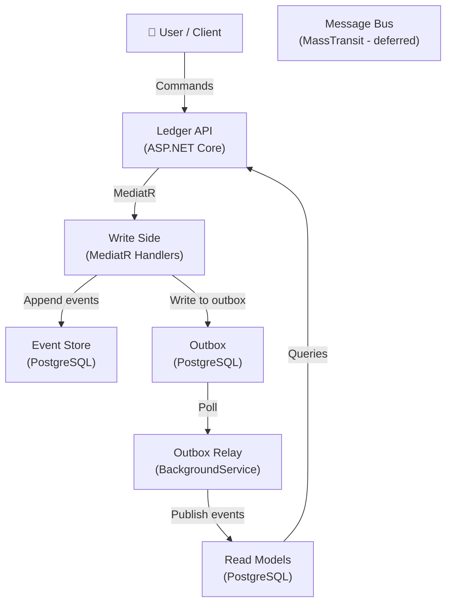
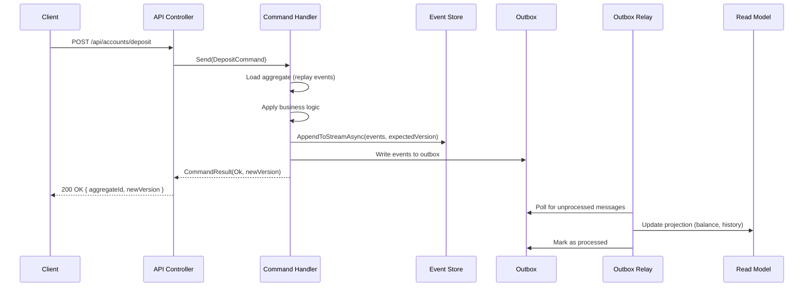
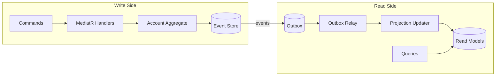

# Architecture

## C4 Context Diagram



## Event Flow (Command Handling Sequence)



## CQRS Read/Write Separation



## Project Structure

```
src/
├── Ledger.Domain/          # Domain model, events, interfaces
│   ├── Account.cs          # Aggregate root
│   ├── Events/             # Domain events
│   ├── Models/             # DTOs for read models
│   └── IEventStore.cs      # Abstractions
├── Ledger.Application/     # CQRS handlers & queries
│   ├── Commands/           # Command records + handlers
│   ├── Queries/            # Query records + handlers
│   └── Handlers/           # MediatR handlers
├── Ledger.Infrastructure/  # Persistence & messaging
│   ├── Data/               # EF Core entities & DbContext
│   ├── EventStore/         # Postgres event store
│   ├── Outbox/             # Outbox relay & projection updater
│   ├── ReadModel/          # PostgreSQL read model
│   └── Snapshots/          # Snapshot store
└── Ledger.Api/             # ASP.NET Core API
    ├── Controllers/        # REST endpoints
    └── Program.cs          # DI configuration
```
